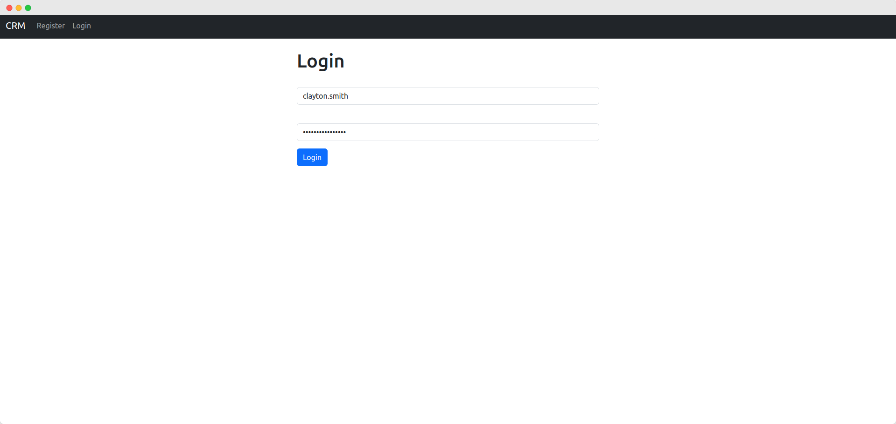

# Django - CRM app

A CRM app powered by Django (v4.2.8)

<br>

## Demo

These are features/pages in the CRM app:

### Register

People can register through the registration page:


After successfully registered, the user is automatically logged in and navigated to the main page:


<hr>

### Login

Once an account has been created, a user can login:



If login is successful, the user is directed to the main page and the following message is shown on the main page:


<hr>

### Main Page

Main page of the CRM app displays a table which includes specific data of records:


<hr>

### Add a Record

A user can add a record by clicking `Add a Record` on the navbar or `Add` button under the table, on the main page:


Next, fill in the inputs with proper values:


Once inputs have been successful, a new record is added to the table with the following message:


<hr>

### Update a Record

In order to update/edit an existing record, click on the pencil mark button, on the main page:


Then, edit data with proper value(s):


Finally, the updated record is displayed on the main page:


<hr>

### Delete a Record

To remove a record, click on the trash bin button, on the main page:


If deletion is successful, the following message is displayed:


<hr>

### Logout

One can logout by clicking the `Logout` text on the navbar:


There you go! Please login again, if you would like to visit the main page or modify records:


<br>

## Prerequisites

Before running the app, please make sure you have following software installed in your machine:
- [Python 3](https://www.python.org/downloads/)
- [pip](https://pip.pypa.io/en/stable/installation/)
- [MySQL](https://dev.mysql.com/doc/mysql-installation-excerpt/8.0/en/)
- [Git](https://github.com/git-guides/install-git)

<br>

## How to Run

1. Create a virtual environment

```
python3 -m venv .venv
```

2. Navigate to this directory, then activate the virtual environment

```
source .venv/bin/activate
```

3. Install required packages

```python
pip3 install -r requirements.txt
```

4. Make a new file named `.env`, then copy `.env.example` and paste the content into it

```
cp .env.example .env
```

After that, fill `.env` with appropriate values

5. Create a database (Make sure you have MySQL installed in your machine beforehand)

```python
python3 mydb.py
```

6. Apply database migration

```python
python3 manage.py migrate
```

7. Create a superuser of Django admin panel

```python
python3 manage.py createsuperuser
```

You will then by asked several questions, such as `username`, `email`, and `password` of the superuser.

8. Finally, run the server!

```python
python3 manage.py runserver
```

9. Voila! Visit `http://localhost:8000` on your browser

<br>

## To-do list:

- Optimize Dockerfile
- Generate `requirements.txt` ✅
- Utilize `python-dotenv` package to store environment variables ✅
- Make a Dockerfile ✅
- Add edit and delete buttons, instead of ID to edit a record ✅
- Install MySQL ✅
- Install MySQL dependencies (`myslqclient` and a necessary python-mysql connector) ✅

<br>

## Reference

- [Django Project – Code a CRM App Tutorial by FreeCodeCamp](https://www.youtube.com/watch?v=t10QcFx7d5k)

<br>


